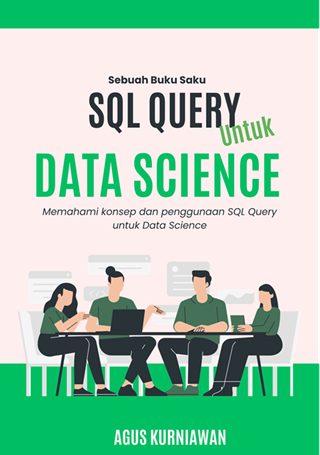

# SQL Query untuk Data Science

Dalam era informasi, kemampuan untuk memahami dan memanipulasi data menjadi salah satu keterampilan paling penting. "SQL Query untuk Data Science" dirancang khusus bagi Anda yang ingin mempelajari cara mengakses, menganalisis, dan memanipulasi data menggunakan SQL, bahasa pemrograman khusus untuk mengelola basis data.

Buku ini menyajikan konsep dasar SQL dengan pendekatan yang praktis dan berorientasi pada data science. Setiap bab disusun secara sistematis, mulai dari pengenalan dasar SQL, operasi CRUD, hingga teknik-teknik lanjutan seperti penggunaan subqueries, common table expressions (CTE), dan analisis time series. Disertai dengan latihan-latihan yang menantang, buku ini memastikan Anda tidak hanya memahami teori, tetapi juga dapat menerapkannya dalam skenario nyata.

Keunggulan lain dari buku ini adalah penggunaan SQLite, sistem manajemen basis data yang ringan dan mudah digunakan, yang memungkinkan Anda untuk fokus pada pembelajaran SQL tanpa terbebani dengan detail teknis dari sistem basis data besar.

Apakah Anda seorang data scientist yang ingin memperkuat keterampilan Anda, seorang profesional IT yang ingin memperluas pengetahuan Anda, atau bahkan seorang pemula yang baru mengenal dunia data, "SQL Query untuk Data Science" akan membimbing Anda melalui setiap langkah dalam perjalanan Anda untuk menjadi ahli dalam SQL.

## Publikasi

* Google Play Books: https://play.google.com/store/books/details?id=y3_XEAAAQBAJ 
* Apple Books: https://books.apple.com/us/book/id6467008228
* Lulu: https://www.lulu.com/shop/agus-kurniawan/sql-query-untuk-data-science/ebook/product-e7erk84.html

